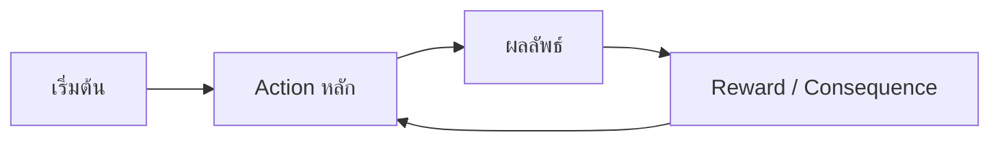

# [ชื่อเกม] — Core Loop & Gameplay

## Core Loop

## Core Mechanics
1. [Mechanic หลักที่ 1 — Rng Serch rescoues ๆ]
2. [Mechanic หลักที่ 2 - Explortion]
3. [Mechanic ----- 3 - Health system]
4. [Mechanic ----- 4 = Sanity system]
5. [Mechanic ----- 5 - Currency/shop]
6. [Mechanic ----- 6 - Upgrade/Tier up]
7. [Mechanic ----- 7 - Perk/Level]
8. [Mechanic ----- 8 - Vision/Sense]
9. [Mechanic ----- 9 - Weapons]
10. [Mechanic ----- 10 - Monster Vision]
## Controls
| Key | Action |
|---|---|
| ← → | Move |
| Space | Jump |
| [E] | [Intraction] |
| [H] | [Hide] |
| [C] | [Counch] |
| [1-9] | [Slot 1-9] |
| [Esc] | Menu |
| [V] | | tools Sense |
| [R] | Reload Gun |

## Win / Lose Condition
- **ชนะเมื่อ:** [เงื่อนไข]
- **แพ้เมื่อ:** [เงื่อนไข]
