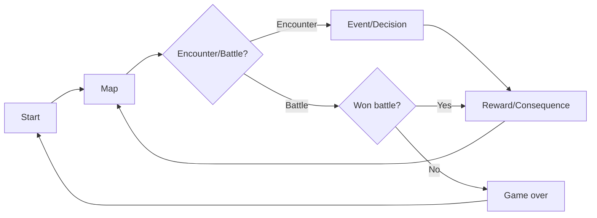

# [ชื่อเกม] — Core Loop & Gameplay

## Core Loop

## Core Mechanics

1. [Mechanic หลักที่ 1 — Rng Search Rescoues]
2. [Mechanic หลักที่ 2 - Map generation]
3. [Mechanic ----- 3 - Health system]
4. [Mechanic ----- 4 = Sanity system]
5. [Mechanic ----- 5 - Currency/shop]
6. [Mechanic ----- 6 - Upgrade/Tier up]?
7. [Mechanic ----- 7 - Perk/Level]?
8. [Mechanic ----- 8 - Weapons/cards]

## Controls

| Key        | Action           |
| ---------- | ---------------- |
| Mouse/Drag | Use card         |
| E          | Use weapon skill |
| R          | Use Item         |
| [Esc]      | Menu             |

## Win / Lose Condition

- **ชนะเมื่อ:** [Endless until Die]
- **แพ้เมื่อ:** [Hp/sanity = 0 or Quit game during in game]
