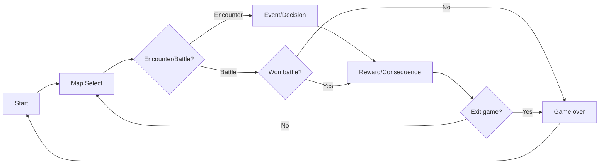

# [Dream slayer] — Core Loop & Gameplay

## Core Loop

## Core Mechanics

1. [Mechanic หลักที่ 1 — Rng Card draw]
2. [Mechanic หลักที่ 2 - Rng room]
3. [Mechanic หลักที่ 3 - Health system]
4. [Mechanic หลักที่ 4 = Sanity system]
5. [Mechanic หลักที่ 5 - Currency/shop]
6. [Mechanic หลักที่ 6 - cards]

## Controls

| Key        | Action   |
| ---------- | -------- |
| Mouse/Drag | Use card |
| [Esc]      | Menu     |

## Win / Lose Condition

- **ชนะเมื่อ:** [ชนะบอส ]
- **แพ้เมื่อ:** [Hp/sanity = 0 or Quit game during in game]
