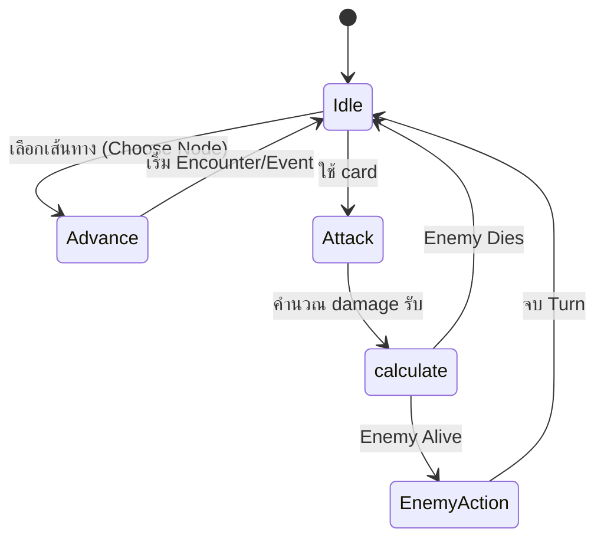

# Mechanic Design — [ชื่อ Mechanic]

## State Diagram

## Rules

| State   | เข้าเงื่อนไข                        | ออกเงื่อนไข | Note                              |
| ------- | ----------------------------------------------- | ---------------------- | --------------------------------- |
| Idle    | เริ่มเกม / หยุดเคลื่อนที่ | กด input ใดๆ      | Animation loop                    |
| Attack  | โจมตีกัน                               | ใช้ card โจมตี | Damage Monster Recieve = X Damage |
| Adcance | Enemy Defeated + Idle State                     | อยุ่ note ไหม่ | Advance1 Step                     |
