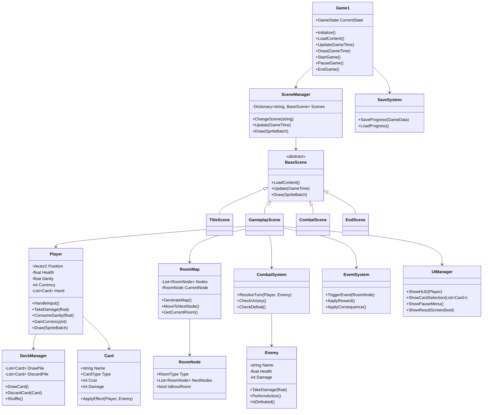

# Class Diagram — Dream Slayer

```mermaid
classDiagram
    class Game1 {
        +GameState CurrentState
        +Initialize()
        +LoadContent()
        +Update(GameTime)
        +Draw(GameTime)
        +StartGame()
        +PauseGame()
        +EndGame()
    }

    class SceneManager {
        -Dictionary~string, BaseScene~ Scenes
        +ChangeScene(string)
        +Update(GameTime)
        +Draw(SpriteBatch)
    }

    class BaseScene {
        <<abstract>>
        +LoadContent()
        +Update(GameTime)
        +Draw(SpriteBatch)
    }

    class TitleScene
    class GameplayScene
    class CombatScene
    class EndScene

    class Player {
        -Vector2 Position
        -float Health
        -float Sanity
        -int Currency
        -List~Card~ Hand
        +HandleInput()
        +TakeDamage(float)
        +ConsumeSanity(float)
        +GainCurrency(int)
        +Draw(SpriteBatch)
    }

    class Card {
        +string Name
        +CardType Type
        +int Cost
        +int Damage
        +ApplyEffect(Player, Enemy)
    }

    class DeckManager {
        -List~Card~ DrawPile
        -List~Card~ DiscardPile
        +DrawCard()
        +DiscardCard(Card)
        +Shuffle()
    }

    class Enemy {
        -string Name
        -float Health
        -int Damage
        +TakeDamage(float)
        +PerformAction()
        +IsDefeated()
    }

    class RoomMap {
        -List~RoomNode~ Nodes
        -RoomNode CurrentNode
        +GenerateMap()
        +MoveToNextNode()
        +GetCurrentRoom()
    }

    class RoomNode {
        +RoomType Type
        +List~RoomNode~ NextNodes
        +bool IsBossRoom
    }

    class CombatSystem {
        +ResolveTurn(Player, Enemy)
        +CheckVictory()
        +CheckDefeat()
    }

    class EventSystem {
        +TriggerEvent(RoomNode)
        +ApplyReward()
        +ApplyConsequence()
    }

    class UIManager {
        +ShowHUD(Player)
        +ShowCardSelection(List~Card~)
        +ShowPauseMenu()
        +ShowResultScreen(bool)
    }

    class SaveSystem {
        +SaveProgress(GameData)
        +LoadProgress()
    }

    Game1 --> SceneManager
    SceneManager --> BaseScene
    BaseScene <|-- TitleScene
    BaseScene <|-- GameplayScene
    BaseScene <|-- CombatScene
    BaseScene <|-- EndScene
    GameplayScene --> Player
    GameplayScene --> RoomMap
    GameplayScene --> CombatSystem
    GameplayScene --> EventSystem
    GameplayScene --> UIManager
    Player --> DeckManager
    Player --> Card
    CombatSystem --> Enemy
    RoomMap --> RoomNode
    Game1 --> SaveSystem
```
