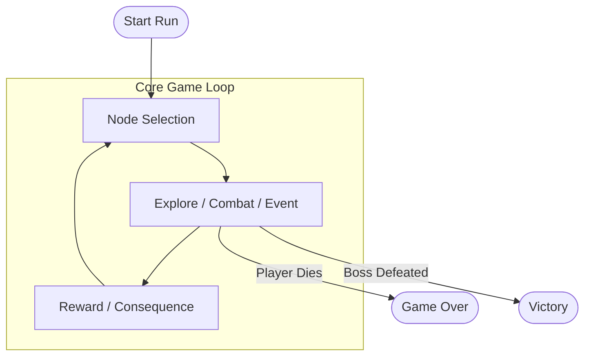
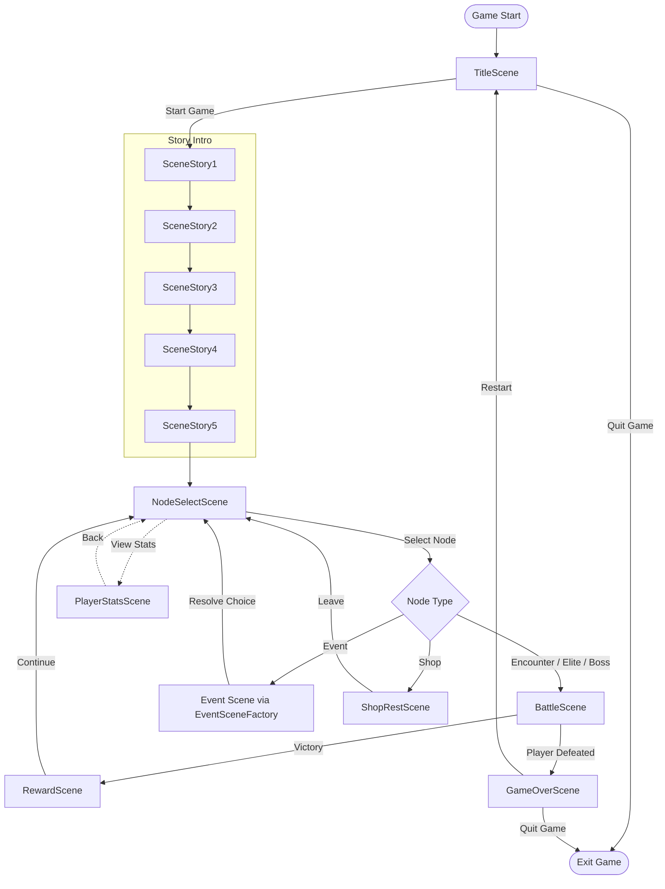

# Class Diagram — Dream Slayer

Set the `hp` variable to `50` in 



```csharp

using System;

public class Program
{
    public static void Main()
    {
        int hp = 50;
        for (int i = 0; i < 5; i++)
        {
            Console.WriteLine(hp);
        }
    }
}
```

```

```


