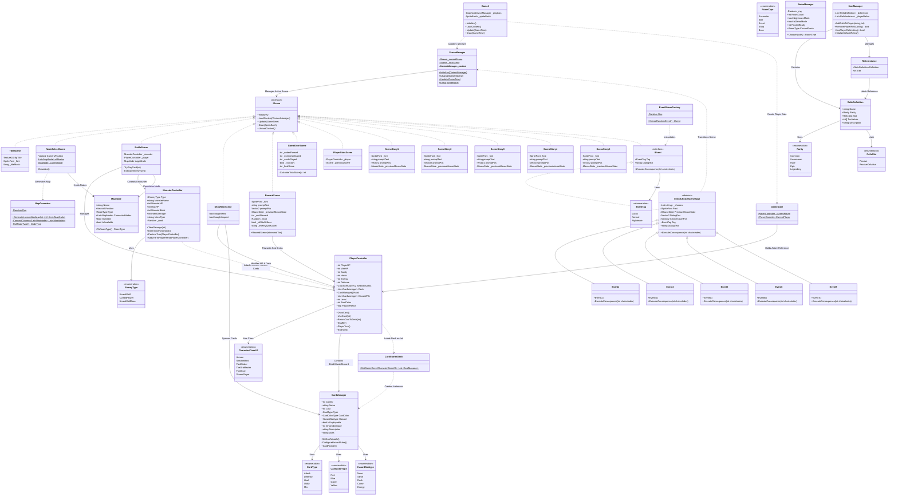

# Class Diagram — Dream Slayer

```mermaid
classDiagram
    class Game1 {
        -GraphicsDeviceManager _graphics
        -SpriteBatch _spriteBatch
        +Initialize()
        +LoadContent()
        +Update(GameTime)
        +Draw(GameTime)
    }

    class GameState {
        -PlayerController _currentPlayer$
        +PlayerController CurrentPlayer$
    }

    class SceneManager {
        -IScene _currentScene$
        -IScene _nextScene$
        -ContentManager _content$
        +Initialize(ContentManager)$
        +ChangeScene(IScene)$
        +Update(GameTime)$
        +Draw(SpriteBatch)$
    }

    class IScene {
        <<interface>>
        +Initialize()*
        +LoadContent(ContentManager)*
        +Update(GameTime)*
        +Draw(SpriteBatch)*
        +UnloadContent()*
    }

    class TitleScene {
        -Texture2D BgTitle
        -SpriteFont _font
        -Song _titleMusic
    }

    class NodeSelectScene {
        -Vector2 CameraPosition
        -List~MapNode~ allNodes$
        -MapNode _currentNode$
        -DrawLine()
    }

    class BattleScene {
        -MonsterController _monster
        -PlayerController _player
        -MapNode targetNode
        -TryPlayCard(int)
        -ExecuteEnemyTurn()
    }

    class ShopRestScene {
        -bool boughtHeal
        -bool boughtInspect
    }

    class RewardScene {
        -SpriteFont _font
        -string promptText
        -Vector2 promptPos
        -MouseState _previousMouseState
        -int _soulReward
        -Random _rand
        -bool _isEliteOrBoss
        -string _enemyTypeLabel
        +RewardScene(int rewardTier)
    }

    class GameOverScene {
        -int _nodesPassed
        -int _enemiesCleared
        -int _cardsPlayed
        -bool _isVictory
        -int _finalScore
        -CalculateTotalScore() int
    }

    class PlayerStatsScene {
        -PlayerController _player
        -IScene _previousScene
    }

    %% Story Scenes Sequence
    class SceneStory1 {
        -SpriteFont _font
        -string promptText
        -Vector2 promptPos
        -MouseState _previousMouseState
    }
    class SceneStory2 {
        -SpriteFont _font
        -string promptText
        -Vector2 promptPos
        -MouseState _previousMouseState
    }
    class SceneStory3 {
        -SpriteFont _font
        -string promptText
        -Vector2 promptPos
        -MouseState _previousMouseState
    }
    class SceneStory4 {
        -SpriteFont _font
        -string promptText
        -Vector2 promptPos
        -MouseState _previousMouseState
    }
    class SceneStory5 {
        -SpriteFont _font
        -string promptText
        -Vector2 promptPos
        -MouseState _previousMouseState
    }

    %% Event Architecture
    class EventTag {
        <<enumeration>>
        Lucky
        Normal
        Nightmare
    }

    class IEvent {
        <<interface>>
        +EventTag Tag
        +string DialogText
        +ExecuteConsequence(int choiceIndex)*
    }

    class EventSceneFactory {
        -Random Rng$
        +CreateRandomEvent()$ IEvent
    }

    class EventChoiceSceneBase {
        <<abstract>>
        -List~string~ _choices
        #SpriteFont Font
        #MouseState PreviousMouseState
        #Vector2 DialogPos
        #Vector2 ChoicesStartPos
        +EventTag Tag
        +string DialogText
        +ExecuteConsequence(int choiceIndex)*
    }

    class Event1 {
        +Event1()
        +ExecuteConsequence(int choiceIndex)
    }
    class Event4 {
        +Event4()
        +ExecuteConsequence(int choiceIndex)
    }
    class Event5 {
        +Event5()
        +ExecuteConsequence(int choiceIndex)
    }
    class Event6 {
        +Event6()
        +ExecuteConsequence(int choiceIndex)
    }
    class Event7 {
        +Event7()
        +ExecuteConsequence(int choiceIndex)
    }

    %% Map and Room Systems
    class RoomType {
        <<enumeration>>
        Encounter
        Elite
        Event
        Shop
        Boss
    }

    class RoomManager {
        -Random _rng
        +int RoomCount
        +bool NightmareMode
        +bool IsDemoMode
        +int FloorDifficulty
        +RoomType CurrentRoom
        +ChooseNode() RoomType
    }

    class MapNode {
        +string Name
        +Vector2 Position
        +NodeType Type
        +List~MapNode~ ConnectedNodes
        +bool IsVisited
        +bool IsAvailable
        +ToRoomType() RoomType
    }

    class MapGenerator {
        -Random Rng$
        +GenerateLovecraftianMap(int, int)$ List~MapNode~
        -ConnectColumns(List~MapNode~, List~MapNode~)$
        -RollNodeType()$ NodeType
    }

    %% Character & Combat Entities
    class CharacterClassV2 {
        <<enumeration>>
        Human
        ShadowBind
        PactBinder
        TheOrbMaster
        TheMixer
        DreamSlayer
    }

    class PlayerController {
        +int PlayerHP
        +int MaxHP
        +int Sanity
        +int Honor
        +int Energy
        +int Defense
        +CharacterClassV2 SelectedClass
        +List~CardManager~ Deck
        +CardManager[] Hand
        +List~CardManager~ DiscardPile
        +int Level
        +int SoulCoins
        +int[] PassiveRelics
        +DrawCard()
        +UseCard(int)
        +ReturnCardToDeck(int)
        +Shuffle()
        +PlayerTurn()
        +EndTurn()
    }

    class EnemyType {
        <<enumeration>>
        UnrealWolf
        CursedFlower
        UnrealWolfBoss
    }

    class MonsterController {
        +EnemyType Type
        +string MonsterName
        +int MonsterHP
        +int MaxHP
        +int MonsterBlock
        +int IntentDamage
        +string IntentType
        -Random _rand
        +TakeDamage(int)
        +DetermineNextIntent()
        +PerformTurn(PlayerController)
        -AddVineToPlayerHand(PlayerController)
    }

    %% Card System
    class CardType {
        <<enumeration>>
        Attack
        Defense
        Heal
        Utility
        Mix
    }

    class CardColorType {
        <<enumeration>>
        Red
        Blue
        Green
        Yellow
    }

    class HazardSubtype {
        <<enumeration>>
        None
        Slime
        Rock
        Curse
        Energy
    }

    class CardManager {
        +int CardID
        +string Name
        +int Cost
        +CardType Type
        +CardColorType CardColor
        +HazardSubtype Hazard
        +bool IsUnplayable
        +int InHandDamage
        +string Description
        +string Does
        -SetCardVisuals()
        -ConfigureHazardRules()
        +CardReader()
    }

    class CardStarterDeck {
        +GetStarterDeck(CharacterClassV2)$ List~CardManager~
    }

    %% Relic / Item System
    class Rarity {
        <<enumeration>>
        Common
        Uncommon
        Rare
        Epic
        Legendary
    }

    class RelicSlot {
        <<enumeration>>
        Passive
        PassiveOrActive
    }

    class RelicDefinition {
        +string Name
        +Rarity Rarity
        +RelicSlot Slot
        +int[] TierValues
        +string Description
    }

    class RelicInstance {
        +RelicDefinition Definition
        +int Tier
    }

    class ItemManager {
        -List~RelicDefinition~ _definitions
        -List~RelicInstance~ _playerRelics
        +AddRelicToPlayer(string, int)
        +RemovePlayerRelic(string) bool
        +HasPlayerRelic(string) bool
        -InitializeDefaultRelics()
    }

    %% Structural Relationships
    Game1 ..> SceneManager : Updates & Draws
    Game1 ..> GameState : Reads Player Data
  
    SceneManager --> IScene : Manages Active Scene
  
    IScene <|.. TitleScene
    IScene <|.. NodeSelectScene
    IScene <|.. BattleScene
    IScene <|.. ShopRestScene
    IScene <|.. RewardScene
    IScene <|.. GameOverScene
    IScene <|.. PlayerStatsScene
    IScene <|.. SceneStory1
    IScene <|.. SceneStory2
    IScene <|.. SceneStory3
    IScene <|.. SceneStory4
    IScene <|.. SceneStory5
    IScene <|.. IEvent

    IEvent <|.. EventChoiceSceneBase
    EventChoiceSceneBase <|-- Event1
    EventChoiceSceneBase <|-- Event4
    EventChoiceSceneBase <|-- Event5
    EventChoiceSceneBase <|-- Event6
    EventChoiceSceneBase <|-- Event7

    IEvent --> EventTag : Uses

    EventSceneFactory ..> IEvent : Instantiates
    EventChoiceSceneBase ..> SceneManager : Transitions Scene
  
    NodeSelectScene ..> MapGenerator : Generates Map
    NodeSelectScene --> MapNode : Holds Nodes
  
    BattleScene --> PlayerController : Manages
    BattleScene --> MonsterController : Controls Encounter
    BattleScene --> MapNode : Completes Node
  
    MonsterController --> EnemyType : Uses
    MonsterController ..> PlayerController : Attacks & Adds Hazard Cards
  
    ShopRestScene --> PlayerController : Modifies HP & Deck
    ShopRestScene --> CardManager : Spawns Cards

    RewardScene --> PlayerController : Rewards Soul Coins
  
    GameState --> PlayerController : Holds Active Reference
    PlayerController --> CharacterClassV2 : Has Class
    PlayerController --> CardManager : Contains Deck/Hand/Discard
    PlayerController ..> CardStarterDeck : Loads Deck on Init
  
    CardStarterDeck ..> CardManager : Creates Instances
    CardManager --> CardType : Uses
    CardManager --> CardColorType : Uses
    CardManager --> HazardSubtype : Uses

    RelicDefinition --> Rarity : Uses
    RelicDefinition --> RelicSlot : Uses
    RelicInstance --> RelicDefinition : Holds Reference
    ItemManager --> RelicDefinition : Contains
    ItemManager --> RelicInstance : Manages
```
