# 48-Hour Timeline — [Project Lobotomy]

| หัวข้อ                             | รายละเอียด                  |
| ---------------------------------------- | ------------------------------------- |
| Time Keeper                              | [ชื่อ]                            |
| Jam เริ่มจริง (วัน-เวลา) | [เช่น ศ. 24 ก.ค. 2569 16:00]   |
| Deadline ส่งงาน (วัน-เวลา)  | [เช่น อา. 26 ก.ค. 2569 19:00] |

> คำนวณ "เวลาจริง" ของแต่ละ Phase จาก **เวลาที่ Jam เริ่มจริง** ด้านบน แล้วเติมในคอลัมน์ขวาสุด — ใช้ตารางนี้เป็นจุดอ้างอิงเดียวของทีมตลอด 48 ชม.

| Phase                                       | ช่วง (Hour) | เวลาจริง (Hour 0 = เวลาเริ่ม Jam) | เป้าหมาย / Deliverable                                                                   | สถานะ | เวลาจริงที่เสร็จ |
| ------------------------------------------- | --------------- | -------------------------------------------------- | ------------------------------------------------------------------------------------------------ | ---------- | -------------------------------- |
| 0. Kickoff & Ideation                       | 0–3            | [16:00] – [19:00]                                 | รู้ theme, brainstorm, ล็อกคอนเซปต์ + core loop 1 บรรทัด                    | 🔲         |                                  |
| 1. Planning & Setup                         | 3–6            | [19:00] – [22:00]                                 | GDD one-pager, ตกลง pipeline, ตั้ง repo, แบ่งงาน                                  | 🔲         |                                  |
| 2. Core Pipeline & Skeleton                 | 6–12           | [22:00] – [04:00]                                 | Game loop โครงหลักรันได้ (state, input, render ว่างเปล่า)                 | 🔲         |                                  |
| 3. Core Mechanic                            | 12–24          | [04:00] – [16:00]                                 | กลไกหลักเล่นได้จริง 1 อย่าง —**Playable Build Checkpoint**        | 🔲         |                                  |
| 4. Content & Feature Build-out              | 24–34          | [16:00] – [02:00]                                 | ด่าน/เนื้อหา, UI/HUD, เสียง, กลไกรอง                                      | 🔲         |                                  |
| 5. 🔒 Feature Freeze                        | ที่ Hour 34  | [02:00]                                            | **ห้ามเพิ่ม feature ใหม่หลังจุดนี้** ทุกคน merge เข้า main | 🔲         |                                  |
| 6. Polish & Bugfix                          | 34–40          | [02:00] – [08:00]                                 | แก้บั๊ก, ปรับ balance, juice/feedback เล็กๆ                                      | 🔲         |                                  |
| 7. Testing (คนนอกทีมลองเล่น) | 40–44          | [08:00] – [12:00]                                 | playtest, จด bug ที่เหลือ, แก้เฉพาะตัวที่ critical                       | 🔲         |                                  |
| 8. Build & Package                          | 44–47          | [12:00] – [15:00]                                 | สร้าง build จริง, ทดสอบบนเครื่องอื่น, เตรียมหน้า submission | 🔲         |                                  |
| 9. Buffer & Submit                          | 47–48          | [15:00] – [16:00]                                 | เผื่อเวลาหน้างาน, ส่งงานก่อนเวลาอย่างน้อย 15 นาที     | 🔲         |                                  |

```mermaid
gantt
    title Game Jam 48 ชั่วโมง — [PROJECT LOBOTOMY]
    dateFormat  X
    axisFormat %s h
    section Plan
    Kickoff & Ideation        :0, 3h
    Planning & Setup          :3, 3h
    section Build
    Core Pipeline & Skeleton  :6, 6h
    Core Mechanic (Playable @24h) :12, 12h
    Content & Feature Build-out :24, 10h
    section Ship
    Polish & Bugfix           :34, 6h
    Testing                   :40, 4h
    Build & Package           :44, 3h
    Buffer & Submit           :47, 1h
```

## กติกา Checkpoint

- ถ้าถึงเวลาใน Phase ใดแล้วยังไม่เสร็จ → **Time Keeper** เรียกประชุมด่วน (ไม่เกิน 5 นาที) เพื่อตัด scope ทันที ตาม cut-list ใน [01-pipeline-checklist.md](01-pipeline-checklist.md)
- ห้ามปล่อยให้ Phase ที่ล่าช้าลากยาวไปกระทบ Phase ถัดไปเกิน [1 ชม.]
- อัปเดตคอลัมน์ "สถานะ" และ "เวลาจริงที่เสร็จ" ทุกครั้งที่ปิด Phase เพื่อให้ทั้งทีมเห็นความคืบหน้าตรงกัน
